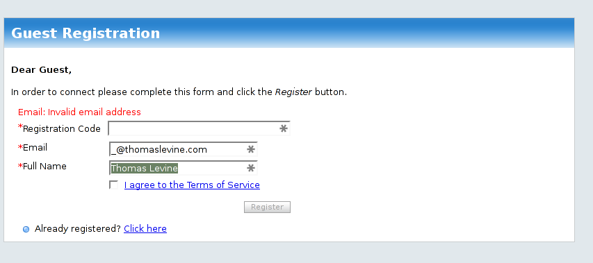

# Email address validation
Lots of people validate email addresses incorrectly. Here are some examples.

My previous address was invalid, but so many people accepted it as valid
that I [thought it was valid](/!/dot-at-thomaslevine-dot-com/).
