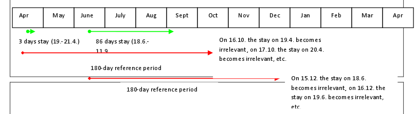
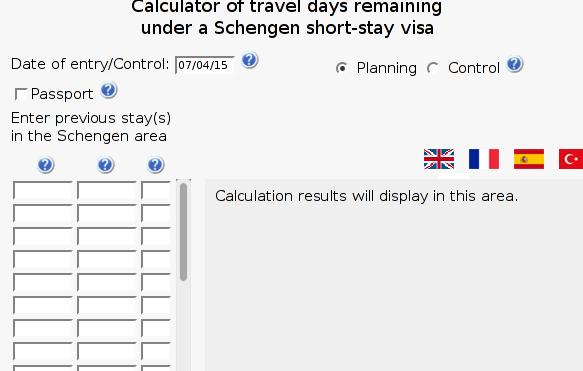

# Determining how long you can stay in the Schengen Area

When I search on the internet, it's pretty easy to find out that a
third-country (such as the United States) national may stay in the
[Schengen Area](https://en.wikipedia.org/wiki/Schengen_Area) for
90 days within a 180-day period. Unfortunately, it took me a while
to figure out exactly how to interpret this. Fortunately, I finally
figured it out!

## The law
As far as I can tell,
[EC 539/2001](http://ec.europa.eu/home-affairs/doc_centre/borders/docs/notification_visa_539_2001_en.pdf)
([Annex II](http://ec.europa.eu/dgs/home-affairs/pdf/20140429_handbook1_annexe_acte_autonome_part1_en.pdf))
is the relevant law, and below is the relevant section, from Annex II.

> The day of entry shall be calculated as the first day of stay in the
> territory of the Member States and the day of exit shall be calculated as the
> last day of stay in the territory of the Member States.
>
> The notion of "any", implies the application of a "moving" 180-day reference
> period, looking backwards, at each day of the stay, into the last 180 days
> period, in order to verify if the 90 days/180 day requirement continues to be
> fulfilled. This means that an absence for an uninterrupted period of 90 days
> allows for a new stay for up to 90 days. 

I found this diagram to be informative.

## Official calculator
There's a rather horrendous calculator that has no legal weight,
but at least I can use it to check my math.

## Conclusion
Here's how I think about the rule: A third country national is allowed to
stay in the Schengen zone tomorrow she or he has spent no more than 89 of
the past 179 days in the Schengen zone.
