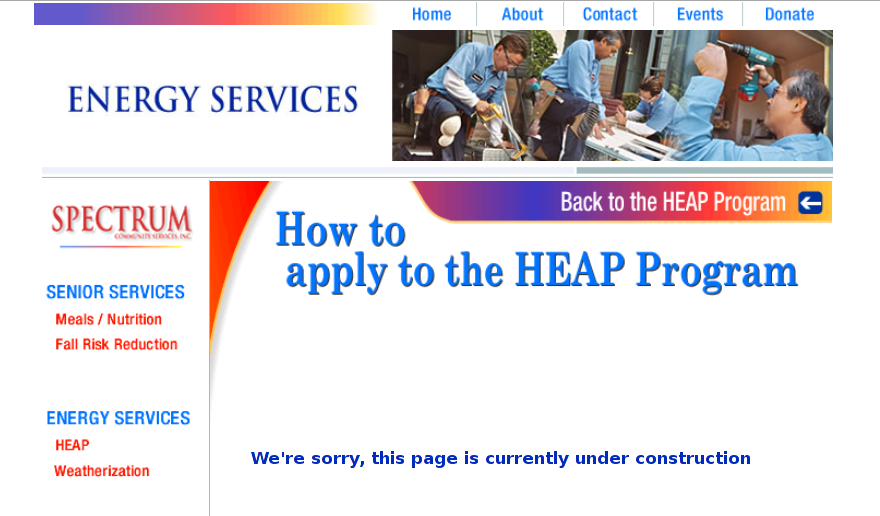

Welfare in Oakland
=============================
I helped some friends in Oakland who were broke not pay money for things
that the government could subsidize instead. And thus I learned a bit about
welfare in Oakland.

Figuring out how to sign up for welfare is hilariously difficult, and signing
up for welfare is quite scary because they use fancy-sounding language without
explaining what it all means. I might make it sound easy below, but you should
expect it to be rather frustrating.

Determining eligibility
----------------------------------------
Eligibility for many of the different programs is based on household annual
income, and determining this can be quite complicated.

What if you just got fired but made lots of money before you got fired?
Or, what if you don't work very often but make good money when you do work?
I have no idea how you are supposed to determine how much money you make.

You are most likely to be eligible for these programs if you have only one
person in your household. Do you need to have your own apartment in order
to be your own household? What if you have an apartment but sublet a room
to other people? What if the people occupying that room change often?

`Marina <http://cooperation.io/>`_ thinks that a "household" is a group of
people that pool income for tax purposes, rather than a bunch of people who
live at the same address.

Like with income, I have no idea how to determine your household size.

Eligibility is also based on other things, but income and household size are
by far the most common and most confusing criteria.

With all the fancy language that I'm seeing in these welfare programs, I get
the impression that the government could claim that you are cheating the system
no matter what your income or household situation is, as they could probably
come up with an explanation as to why your assessment of your situation was
incorrect.

On the other hand, I get the feeling that these welfare programs have few
enough staff that they wouldn't have time to check whether you are actually
eligible, (I got this impression because of long it took before I ever wound
up talking to a person.) so you might be fine even if you make an outrageous
lie about your income or household situation.

Utilities
---------------
Their electricity and gas was going to get turned off if they didn't pay by
a certain day.

PG&E Cares
~~~~~~~~~~~~~~~~~~
I first had them sign up for
`PG&E Cares <http://www.pge.com/en/myhome/customerservice/financialassistance/care/index.page>`_,
which gives discounts to people with
`low income <http://www.pge.com/en/myhome/saveenergymoney/financialassistance/care/eligibility/index.page>`_.
The friends had to wait a few days
before learning whether they were accepted, and they were able to check on
the PG&E website as to whether they were granted the discount. The website
said that they were ineligible but that they could contact PG&E about this,
either by phone at tel:1-866-743-2273 or by email at mailto:CAREandFERA@pge.com.
(`FERA <http://www.pge.com/en/myhome/saveenergymoney/financialassistance/fera/index.page>`_
is similar to CARE but is only available for households of
`three people or more <http://www.pge.com/en/myhome/saveenergymoney/financialassistance/fera/eligibility/index.page>`_.)

Alternative payment plan
~~~~~~~~~~~~~~~~~~~~~~~~~~~~
I also called PG&E at tel:1-800-743-5000 and switched them to
an "alternative payment plan" that give them two extra weeks before they
needed to pay the present bill and that spread the bill across four months,
with no additional costs.

Home Energy Assistance Program
~~~~~~~~~~~~~~~~~~~~~~~~~~~~~~~~~
With extra time to pay the bill, I helped them sign up for the
`Home Energy Assistance Program (HEAP) <http://www.benefits.gov/benefits/benefit-details/1540>`_.
`Spectrum <http://www.spectrumcs.org/>`_ is the provider in Oakland;
if you're in another part of California, check
`this page <http://www.csd.ca.gov/Services/FindServicesinYourArea.aspx>`_.
to find your provider.

People who are eligible are entitled to free
`weatherization <http://www.spectrumcs.org/newspectrum/services/weatherization.htm>`_
(insulation and stuff, I think) and
"`a one-time payment per program year <http://www.spectrumcs.org/newspectrum/services/heap.htm>`_.
I think this latter aspect of the program is intended for emergencies where
the household can't pay its utilities bill one month; as one grateful
anonymous patron supposedly said,

> When my lights were turned off, Spectrum paid my PG&E bill and got them back
> on. I don't know what I would have done without their assistance.

You supposedly can "[c]all HEAP AT `(510) 881-0300 <tel:1-510-881-0300>_`
to have an application mailed to you". When I called I found no option for
getting an application mailed. The closest thing I heard was to press 3 if
I had received a 48 hour notice or gotten my power turned off, so I did that.
I was instructed to leave my name and number, and they would get back to me.
And then after you HEAP pays the full balance of the account if they decide
that the people qualify?

These friends are so broke that they don't have phones, so I gave the phone
number of someone else they knew, and the only phone call she has received
since is a telemarketer trying to sell home security stuff.

I'm going to next try contacting
`Kari Sardell <http://www.spectrumcs.org/newspectrum/services/contact.htm>`_
at either tel:1-510-881-0300, extension 216, or at mailto:ksardell@spectrumcs.org.
Call HEAP AT (510) 881-0300 to have an application mailed to you

I also discovered that, while
`How to apply to the HEAP Program <http://www.spectrumcs.org/newspectrum/services/heap-apply.htm>`_
"is currently under construction",

it wasn't under construction on
`October 26, 2013 <https://web.archive.org/web/20131026080135/http://www.spectrumcs.org/newspectrum/services/heap-apply.htm>`_.
At that time, it was apparantly possible to apply in person at city hall!

.. line-block::

    **Option 2: Apply in Person**
    Pick up, fill out and leave applications at:

    Oakland Community Assistance Office
    One Frank Ogawa Plaza, Room #123, Oakland, Ca 94612

It might be easier to apply for this if you're
`already on food stamps <http://www.liheap.us/california-heap/>`_.

Other things
~~~~~~~~~~~~~~~~~

* `REACH <http://www.pge.com/en/myhome/saveenergymoney/financialassistance/reach/eligibility/index.page>`_
  pays your utilities bill in case of an "uncontrollable or unplanned change in
  [your] ability to pay their PG&E bill." I figure that this would have to be
  something like getting fired from a job or getting hurt and thus having high
  medical bills.
* PG&E might have some more things that I didn't look at on their
  `assistance programs <http://www.pge.com/en/myhome/saveenergymoney/financialassistance/index.page>`_ page.
* http://ac-ocap.com/

Free "lifeline" phone
------------------------
If you are eligible, you are entitled to one "lifeline" phone through
any of `these providers <http://www.phone-bill-assistance.com/lifeline/CA>`_.

Most of them are landline phones, and two are mobile phones. My friend
wanted a mobile phone, so he had to first decide whether he wanted
Cricket or ReachOut. There are two "methods" of applying, and these are
called method 1 and method 2. If you are already enrolled in
`certain welfare programs <http://www.cpuc.ca.gov/puc/telco/public+programs/ults.htm>`_,
you can apply by method 1. If not, you can only apply based on income, with method 2.

Go `here <https://www.cricketwireless.com/o/support/account-management/cricket-lifeline-credit/application-info-by-state-a-f.html#california>`_
to apply for Cricket by either method.

ReachOut wireless has separate forms for 
`method 1 <https://www.reachoutmobile.com/images/downloadablePDF/download_CA.pdf>`_ and
`method 2 <https://www.reachoutmobile.com/images/downloadablePDF/CA%202013%20Income-Based%20Form.pdf>`_.
