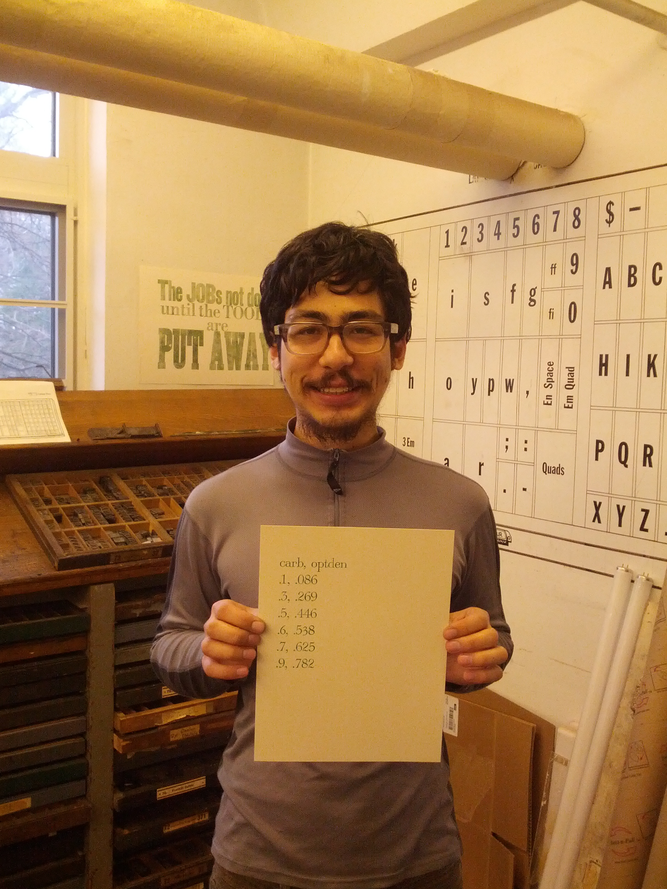
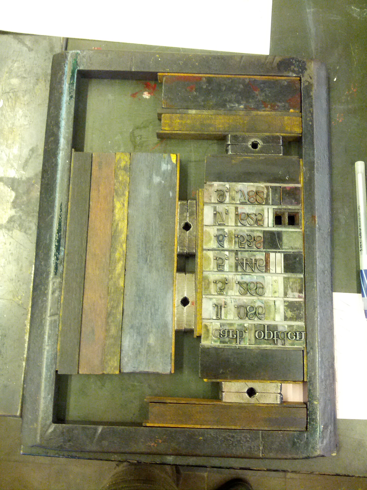

tags: ['letterpress']
description: The formaldehyde dataset printed on letterpress in CSV format
facebook_image: csv-print-square.jpg
twitter_image: csv-print-square.jpg
-------

print(Formaldehyde)
======================
Here is a CSV file.

I printed it on letterpress, just like how they made spreadsheets in
the old days.

The table is also shown below in digital form.

.. csv-table::

    carb,optden
    0.1,0.086
    0.3,0.269
    0.5,0.446
    0.6,0.538
    0.7,0.625
    0.9,0.782

Dataset
-------------
The dataset is derived from the
`Formaldehyde <http://stat.ethz.ch/R-manual/R-devel/library/datasets/html/Formaldehyde.html>`_
dataset from base R, which is taken from the following sources.

* Bennett, N. A. and N. L. Franklin (1954) *Statistical Analysis in
  Chemistry and the Chemical Industry*.  New York: Wiley.
* McNeil, D. R. (1977) *Interactive Data Analysis*. New York: Wiley.

As summarized in the R help,

    These data are from a chemical experiment to prepare a standard
    curve for the determination of formaldehyde by the addition of
    chromatropic acid and concentrated sulphuric acid and the reading
    of the resulting purple color on a spectrophotometer.

The references are proprietary, so I didn't manage to trace the source
any further, but this sounds like
`NIOSH method 3500 <http://www.cdc.gov/niosh/docs/2003-154/pdfs/3500.pdf>`_
(`mirror <3500.pdf>`_)) for formaldehyde analysis.

Encoding error
------------------
"6" was swapped for the highlighted "5"
because I ran out of 6s; in the original dataset, the fifth value
of "optden" is 0.62\ **6** instead of 0.625.
