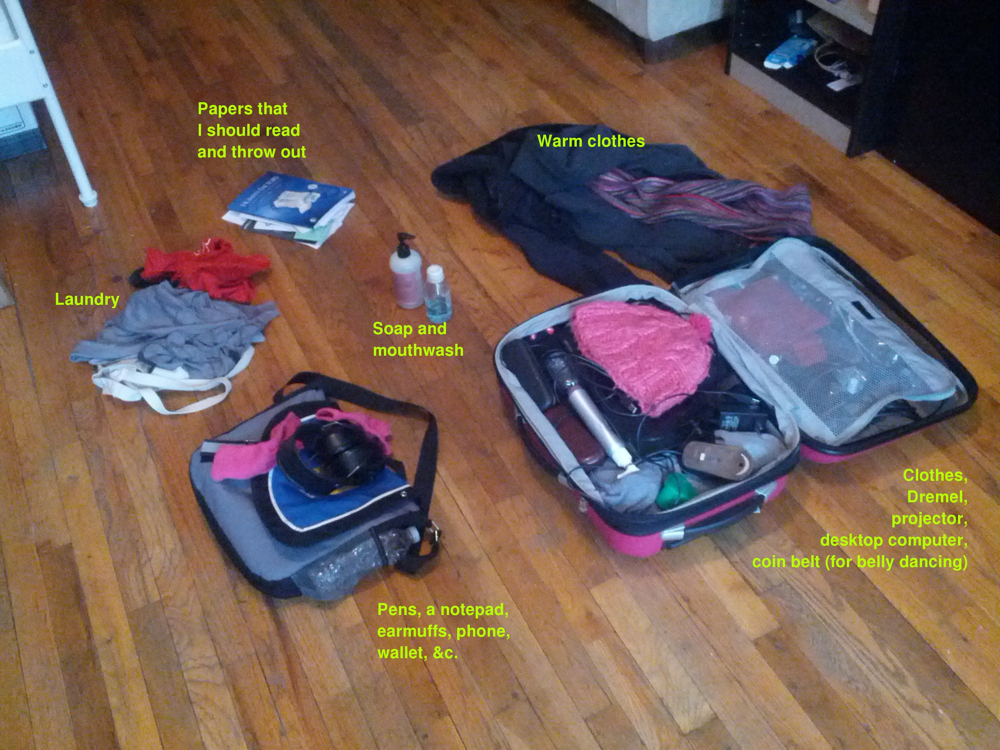

February 2014
======================

Three months ago, I noticed that everything in my apartment that
I cared about fit in a big suitcase and a big backpack. That was
small enough that I thought it would be fun and easy to bounce
around between different places.

But it felt silly to carry all that stuff, so
I've since gotten the stuff down to a small suitcase and a small
messenger bag; here it is.

The larger things are

* Five shirts
* More than five pairs of socks and underwear
* Two pairs of pants
* Two sweaters
* A jacket
* A Dremel
* A coin belt (for belly dancing)
* Papers that I really don't need
* Toiletries

I think I can get rid of some of the papers, some of the socks, and
some of the underwear.

The socks are
Injinji mini-crew black original-weight ([a](socks-a.png), [b](socks-b.png))
When I bought them, one could find them on the REI website as
[this item](http://www.rei.com/product/711809/injinji-performance-series-original-weight-mini-crew-toesocks)
and [this item](http://www.rei.com/product/728375/injinji-performance-series-original-weight-crew-toesocks).
