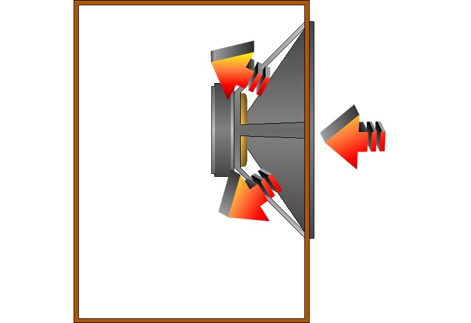

# Plotting data as music videos in R
[UseR! 2015](http://user2015.math.aau.dk/contributed_talks#61)

## The promise of music videos
Let's talk about why we plot data. Data are abstract numbers that
become meaningful to us only when we can perceive them.

We typically map the data to visuals, and we call this process
"data visualization".

But the result doesn't have to be visuals; plotting data is the
conversion of data from abstract numbers to metaphors that we can
perceive. The sense that we use to perceive the plot isn't
fundamental to plotting.

> odor...

In order that our visualizations can reveal unexpected patterns,
it is important that we present many dimensions at once.

> Escape flatland. (Tufte)

Also, data are much more complex than they were in the past, so we
increasingly need to represent highly complex datasets. There is only
so much big data that we can fit in a visualization.

We can apply a model to reduce the data to something more manageable,
but when we do this, we lose the opportunity to analyze the raw variables.

So this doesn't fix the problem; if we want to represent more
variables in their original form, we need more bandwidth.

I have been trying to use our non-visual senses to increase our sensory
bandwidth.

> Our first data music video

<video src="http://dada.pink/gastronomification-big-data-talk/fms-symphony-1.webm" controls></video>

(Explain the video.)

> How this came about

Well, to start, R is a pretty good tool for making data music videos.

> If you are going to make data music videos, R is a good tool.
>
> 1. Vector graphics (for video)
> 2. Optimized matrix operations (for music)
> 3. Integrations with many standard data stores

But that still doesn't explain how this all happened.

Now is a good time for me to tell you a bit more about myself.

> I am bizarrely proficient at base R graphics.

I started using R around the time I took my first statistics
course, which was nine years ago.

> Pro tip: Free software is usually better.

I looked at the various free software for statistics, and R seemed
like the best one. I think it was a good choice.

> I made graphs in base R graphics. (You should use ggplot.)

I kind of knew about ggplot at the time, but I didn't use it for
some reason. In retrospect, I think videos are easier to make in
base R graphics, but ggplot is better for pretty much anything else.
Here's the first video I made in R.

Several years later, I met Brian.

Brian has a background in music, and he had started making music in R.

We're part of a group called "csv soundsystem" that works on
projects around music, journalism, computer programming.

One of us had
taken interest in the United States Treasury data that you experienced
earlier, so we assembled the data one weekend and made that video.

## How to make music videos in R
I hope I have convinced you that data music videos are promising
enough that you'll at least watch me show you how to make them in R.
I'm going to show you how to make video, how to make music, and how
to combine the two.

1. Video
2. Music
3. Combining music and video

### Video is a series of still images
Video is a series of still images. Consider the following
projectile-plotting code.

    plot.projectile <- function(t, x, y) {
      plot(x = x, y = y, cex = 10, ylim = c(0, max(Y)),
           xlab = 'Horizontal displacement', ylab = 'Height', bty = 'l',
           main = 'A projectile', sub = 'Position over time')
      text(x = x, y = y, label = paste0('t=', t))
    }

#### Plot a single frame.
We have a function for calculating the X and Y displacement of the
projectile at a given time. We can plot the position at a given time.

    png('projectile-single-position.png')
    plot.projectile(t = 0, x = 4, y = 30)
    dev.off()

We can also plot several positions on one plot.

    d.x <- function(v0, t) t * v0
    d.y <- function(v0, k, t) -16 * t^2 + v0 * t + k

    projectile <- data.frame(T = seq(0, 9, .5),
                             X = d.x(4, T),
                             Y = d.y(100, 0, T))

    png('projectile-single-position.png')
    plot.projectile(projectile$T, projectile$X, projectile$Y)
    dev.off()

#### Plot many frames.
It's just a small step to video.

    for (i in rownames(projectile)) {
      row <- projectile[i,]
      png(paste0('projectile-video-', i, '.png))
      plot.projectile(row$T, row$X, row$Y)
      dev.off()
    }

#### Make it look nice.
Let's start with a really simple plot.

    plot(
      x=0,
      y=0
    )

First, let's set the dimensions.

    height.vid <- 9/16
    width.vid  <- 16/9

    plot(
      x=0,
      y=0,
      xlim=-2+c(1,80),
      ylim=-15+c(-15,height.vid*80-15)
    )

Now let's set the aspect ratio so that the canvas size doesn't affect
how the plot looks.

    plot(
      x=0,
      y=0,
      xlim=-2+c(1,80),
      ylim=-15+c(-15,height.vid*80-15),
      asp=1
    )

I'm removing the xlab and xlab because they're not in the places
I want them.

    plot(
      x=0,
      y=0,
      xlim=-2+c(1,80),
      ylim=-15+c(-15,height.vid*80-15),
      asp=1,
      xlab='',
      ylab='',
      main=''
    )

And now I'm removing the axes

    plot(
      x=0,
      y=0,
      xlim=-2+c(1,80),
      ylim=-15+c(-15,height.vid*80-15),
      asp=1,
      xlab='',
      ylab='',
      main='',
      axes=F,
      type='n'
    )

and the data.

    plot(
      x=0,
      y=0,
      xlim=-2+c(1,80),
      ylim=-15+c(-15,height.vid*80-15),
      asp=1,
      xlab='',
      ylab='',
      main='',
      type='n'
    )

The result is a blank canvas with a coordinate system configured
exactly as we want. Now we can start adding things on top.

### Sound is a series of air pressures
Your recognizes the changes in air pressure as sound.

Digitally, we can represent sound as a series of air pressure numbers,
and we can create sound by moving a speaker back and forth.

If the speaker is all the way in, let's say that the number is
negative one,

and if it's all the way out, let's say the number is positive one.

    png('sine.png', width = 800, height = 450)
    curve(sin, 0, 4 * pi, bty = 'l',
          xlab = 'Time', ylab = 'Air pressure')
    dev.off()

When you see sound represented as a sine wave, you're seeing a plot of
air pressure over time.

Our ear pays attention mostly to how the air pressure changes, not to
the absolute pressure value. For example, if the air pressure goes up
and down at a higher frequency, we perceive the sound as higher pitched.

#### Synthesizing sound with R

Example of tuneR

scales

arpeggios

indexing

...

## Why this matters

### The business case
If you have a particularly complex and difficult dataset, data music
videos might give you a good and fast return on investment.
But the tools for this aren't fully developed and stable, so I can't
recommend it in general.

### Stop limiting yourself to "visualization"
You can still draw some useful inspiration from data music.
I am amused that this talk was included in the "visualization" track.

It's about plotting, converting data from abstract to concrete
metaphors...
we have to find the meaningful representation, and that's about
leveraging our existing intuitions; there's nothing specifically
visual about it.

I think we started out calling this stuff "visualization" because
it's easier to record and read visual things like books rather than
things with other senses, like smell....

### 

<!--

-->
