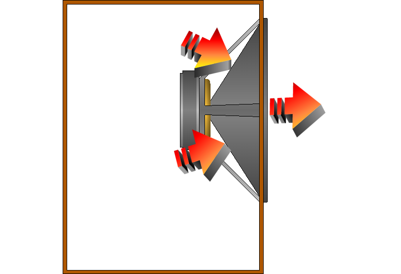

> **Plotting data as music videos in R**  
> <small>Thomas Levine, dada artist</small>

[UseR! 2015](http://user2015.math.aau.dk/contributed_talks#61)

I'm a neo-Dadaist, and I have been experimenting with the use of
music videos for data analysis.

1. Some theory and history behind data music videos
2. How to make data music videos in R
3. Relevance of data music videos in practice

The majority of my talk will be on how to make music videos in R.
I'll start with an introduction into the theory behind data music
videos, then I'll discuss some details of the R programming, and
I'll conclude with some advice on how you can use data music videos
in practice.

## 1. Theory and history

### Why we plot data in the first place
Let's talk about why we plot data.

Data are abstract numbers that
become meaningful to us only when we can perceive them.

In order to perceive the data, we must convert them to a metaphor
that we understand. We typically use the metaphors of tables and
scatterplots, but anything could represent our data; for example,
perhaps we could even use kebabs as a metaphor.

In practice, we usually map the data to visuals, and not to kebabs,
and we call this process "data visualization".

### My first data music video
I sometimes collaborate with a group called "csv soundsystem", and
our first music video was a story of the fiscal policy of the United States.

> [FMS Symphony](http://dada.pink/gastronomification-big-data-talk/fms-symphony-1.webm)

(The video is explained [here](/!/fms-symphony/).)

> How this came about

Where did we get the idea to make data music videos in R?
Well, to start, R is a pretty good tool for making data music videos.

> If you are going to make data music videos, R is a good tool.
>
> 1. Vector graphics (for video)
> 2. Optimized matrix operations (for music)
> 3. Integrations with many standard data stores

But that still doesn't explain how this all happened.

### More about me
Now is a good time for me to tell you a bit more about myself.

> I am bizarrely proficient at base R graphics.

I started using R around the time I took my first statistics
course, which was nine years ago.

> Pro tip: Free software is usually better.

I looked at the various free software for statistics, and R seemed
like the best one. I think it was a good choice.

> I made graphs in base R graphics. (You should use ggplot.)

I kind of knew about ggplot at the time, but I didn't use it for
some reason. In retrospect, I think videos are easier to make in
base R graphics, but ggplot is better for pretty much anything else.
Here's the first video I made in R.

> [Christmas gifts](http://small.dada.pink/christmas/christmas.webm)

Several years later, I met Brian.

Brian has a background in music, and he had started making music in R.

We're part of that group called "csv soundsystem" that works on
projects around music, journalism, computer programming.

One of us had
taken interest in the United States Treasury data that you experienced
earlier, so we assembled the data one weekend and made that video.

## 2. How to make music videos in R
Now let's move on to the part of the talk where I show you how to make
music videos in R.
I'm going to show you how to make video, how to make music, and how
to combine the two.

1. Video
2. Music
3. Combining music and video

### Video is a series of still images
Video is a series of still images. Consider the following
projectile-plotting code.

    plot.projectile <- function(t, x, y) {
      plot(x = x, y = y, cex = 10, ylim = c(0, max(Y)),
           xlab = 'Horizontal displacement', ylab = 'Height', bty = 'l',
           main = 'A projectile', sub = 'Position over time')
      text(x = x, y = y, label = paste0('t=', t))
    }

#### Plot a single frame.
We have a function for calculating the X and Y displacement of the
projectile at a given time. We can plot the position at a given time.

    png('projectile-single-position.png')
    plot.projectile(t = 0, x = 4, y = 30)
    dev.off()

We can also plot several positions on one plot.

    d.x <- function(v0, t) t * v0
    d.y <- function(v0, k, t) -16 * t^2 + v0 * t + k

    projectile <- data.frame(T = seq(0, 9, .5),
                             X = d.x(4, T),
                             Y = d.y(100, 0, T))

    png('projectile-single-position.png')
    plot.projectile(projectile$T, projectile$X, projectile$Y)
    dev.off()

#### Plot many frames.
It's just a small step to video.

    for (i in rownames(projectile)) {
      row <- projectile[i,]
      png(paste0('projectile-video-', i, '.png))
      plot.projectile(row$T, row$X, row$Y)
      dev.off()
    }

#### Make it look nice.
Another thing you need to know is how to remove all of the default
components of base R plots so that you can add only the things that
you want. This code basically does that.

    height.vid <- 9/16
    width.vid  <- 16/9
    plot(x=0, y=0, asp=1, type='n',
         xlim=-2+c(1,80),
         ylim=-15+c(-15,height.vid*80-15),
         xlab='', ylab='', main='')

The result is a blank canvas with a coordinate system configured
exactly as we want. Now we can start adding things on top.

Video is a series of frames, and each frame is a plot. Draw rectangles
with the `rect` function, lines with the `lines` function, faces with
the `face` function, and so on.

In the Christmas gifts video, I wound up drawing my own axes with
`lines` and `text`.

### Synthesizing music with R
If we plot data in the form of music, we are mapping changes in the
data to musical metaphors.

* Rhythm
* Pitch
* Tempo
* Volume

For example, we might use data to vary the rhythm, the pitch, the tempo,
or the volume of a phrase fo music.

#### Phrase-based parameters

iriscore phrase declaration

scales

arpeggios

indexing

...

#### Beats as rows
Another way to convert data into music is to treat each beat of music
as a record in a data table

#### Sound is a series of air pressures
Your recognizes the changes in air pressure as sound.

Digitally, we can represent sound as a series of air pressure numbers,
and we can create sound by moving a speaker back and forth.

If the speaker is all the way in, let's say that the number is
negative one,

and if it's all the way out, let's say the number is positive one.

    png('sine.png', width = 800, height = 450)
    curve(sin, 0, 4 * pi, bty = 'l',
          xlab = 'Time', ylab = 'Air pressure')
    dev.off()

When you see sound represented as a sine wave, you're seeing a plot of
air pressure over time.

Our ear pays attention mostly to how the air pressure changes, not to
the absolute pressure value. For example, if the air pressure goes up
and down at a higher frequency, we perceive the sound as higher pitched.

> tuneR

Example of tuneR

### Combining music and video
I generate an image file for each frame of video and a single audio
file for the entire song. Then I combine them with this command.

    system(paste(
      'avconv',
      '-r 1 -i frame-%03d.png -i song.wav',
      '-y -pix_fmt yuv420p -r 1',
      '-strict -2',
      'musicvideo.webm'))

This loads the video frames (`frame-%03d.png`) and the song file
(`song.wav`) and creates a video file with a frame rate of one
frame per second (`-r 1`). This means that each frame is played
for a full second. And the video file is called `musicvideo.webm`.

## 3. Why this matters

### The business case
If you have a particularly complex and difficult dataset, data music
videos might give you a good and fast return on investment.
But the tools for this aren't fully developed and stable, so I can't
recommend it in general.

### Getting people excited about data
One place that data music videos can fit in right now is in making
data more exciting.

(camayak)

### Escaping flatland (Tufte)
In order that our visualizations can reveal unexpected patterns,
it is important that we present many dimensions at once.

Also, data are much more complex than they were in the past, so we
increasingly need to represent highly complex datasets. There is only
so much big data that we can fit in a visualization.

We can apply a model to reduce the data to something more manageable,
but when we do this, we lose the opportunity to analyze the raw variables.

So this doesn't fix the problem; if we want to represent more
variables in their original form, we need more bandwidth.

I have been trying to use our non-visual senses to increase our sensory
bandwidth.

döner

### Stop limiting yourself to "visualization"
You can still draw some useful inspiration from data music.
I am amused that this talk was included in the "visualization" track.

It's about plotting, converting data from abstract to concrete
metaphors...
we have to find the meaningful representation, and that's about
leveraging our existing intuitions; there's nothing specifically
visual about it.

I think we started out calling this stuff "visualization" because
it's easier to record and read visual things like books rather than
things with other senses, like smell....

### 

## Appendix

### Making plots look nice, in detail
Let's start with a really simple plot.

    plot(
      x=0,
      y=0
    )

First, let's set the dimensions.

    height.vid <- 9/16
    width.vid  <- 16/9

    plot(
      x=0,
      y=0,
      xlim=-2+c(1,80),
      ylim=-15+c(-15,height.vid*80-15)
    )

Now let's set the aspect ratio so that the canvas size doesn't affect
how the plot looks.

    plot(
      x=0,
      y=0,
      xlim=-2+c(1,80),
      ylim=-15+c(-15,height.vid*80-15),
      asp=1
    )

I'm removing the xlab and xlab because they're not in the places
I want them.

    plot(
      x=0,
      y=0,
      xlim=-2+c(1,80),
      ylim=-15+c(-15,height.vid*80-15),
      asp=1,
      xlab='',
      ylab='',
      main=''
    )

And now I'm removing the axes

    plot(
      x=0,
      y=0,
      xlim=-2+c(1,80),
      ylim=-15+c(-15,height.vid*80-15),
      asp=1,
      xlab='',
      ylab='',
      main='',
      axes=F,
      type='n'
    )

and the data.

    plot(
      x=0,
      y=0,
      xlim=-2+c(1,80),
      ylim=-15+c(-15,height.vid*80-15),
      asp=1,
      xlab='',
      ylab='',
      main='',
      type='n'
    )

The result is a blank canvas with a coordinate system configured
exactly as we want. Now we can start adding things on top.

### Realtime sound-synthesis approaches
I am very dissatisfied with my approach of writing wave files, as they
are very slow to write. Two alternatives are to use midi, where you
specify the notes to be played and then the sounds come from a
ready-made library called a sound font, or a realtime sound synthesis
thingy like Supercollider.

* Midi
* Realtime sound wave synthesis

I have dabbled with both of these, but I wind up writing my own sound
synthesis software that writes wave files because configuring midi or
Supercollider is too hard for me.

> The hardest part of making data music videos is configuring audio on Linux

The hardest part of making data music videos is configuring audio on Linux

