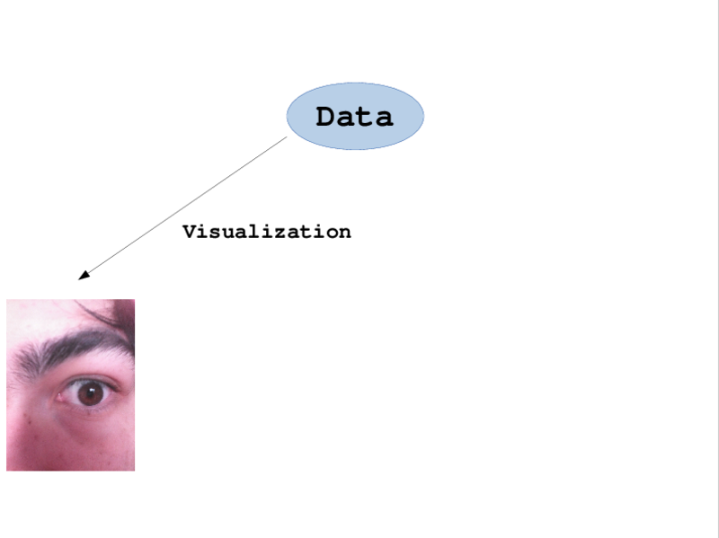

> **Plotting data as music videos in R**  
> <small>Thomas Levine, dada artist</small>

[UseR! 2015](http://user2015.math.aau.dk/contributed_talks#61)

I have been experimenting with the use of
music videos for data analysis.

1. Some theory and history behind data music videos
2. How to make data music videos in R
3. Relevance of data music videos in practice

I'll start with some theory behind data music, then
I'll discuss some details of the R programming, and
I'll conclude with some advice on how you can use data music videos
in practice.

## 1. Theory and history

### Why we plot data in the first place
Let's talk about why we plot data.

Data are abstract numbers that
become meaningful to us only when we can perceive them.

In order to perceive the data, we must convert them to a metaphor
that we understand.

We typically use the metaphors of scatterplots

and tables, but anything could represent our data; for example,
perhaps we could even use

kebabs as a metaphor.

> Visualization

In practice, we usually map the data to graphs, and not to kebabs,
and we call this process "data visualization".

> Musicification

Similarly, we could map the data to music. We'd have to call that
something else--maybe "musicification".

### My first data music video
The first data music video I made was a collaboration as part of the
art collective csv soundsystem.

> [FMS Symphony](http://dada.pink/gastronomification-big-data-talk/fms-symphony-1.webm)

(The video is explained [here](../fms-symphony/).)

## 2. How to make music videos in R
Now let's move on to the part of the talk where I show you how to make
music videos in R.

1. Video
2. Music
3. Combining music and video

I'm going to show you how to make video, how to make music, and how
to combine the two.

### Video is a series of still images
Have you ever made an image in R?
Video is a series of still images.

    plot.projectile <- function(t, x, y) {
      plot(x = x, y = y, cex = 10,
           asp = 1, xlim = c(0, 150), ylim = c(0, 200),
           xlab = 'Horizontal displacement', ylab = 'Height', bty = 'l',
           main = 'A projectile', sub = 'Position over time')
      text(x = x, y = y, label = paste0('t=', t))
    }

Here's a function that plots
the position of a projectile. Don't worry that much about how it works.

#### Plot a single image.
We can plot the position at a given time.

    png('projectile-single-position.png',
        width = 900, height = 450)
    plot.projectile(t = 0, x = 4, y = 130)
    dev.off()

We can also plot several positions on one plot.

    d.x <- function(v0, t) t * v0
    d.y <- function(v0, k, t) -16 * t^2 + v0 * t + k

    projectile <- data.frame(T = seq(0, 6, .5))
    projectile$X <- d.x(20, projectile$T)
    projectile$Y <- d.y(100, 0, projectile$T)

    png('projectile-several-positions.png',
        width = 900, height = 450)
    plot.projectile(projectile$T, projectile$X, projectile$Y)
    dev.off()

#### Plot many images.
It's just a small step to video.

    png('projectile-video-%02d.png',
        width = 900, height = 450)
    for (i in 1:nrow(projectile)) {
      row <- projectile[i,]
      plot.projectile(row$T, row$X, row$Y)
    }
    dev.off()

#### Remove the default plot elements
If you call `plot` with no arguments, you get axes, limits, and other
things that aren't necessarily what you want. If you were using grid
graphics, you could remove them.

    plot(
      x=0,
      y=0,
      xlim=-2+c(1,80),
      ylim=-15+c(-15,(9/16)*80-15),
      asp=1, # Aspect ratio
      xlab='', # Labels
      ylab='',
      main='',
      axes=FALSE,
      type='n' # Don't plot any data.
    )

In base graphics, we need to do wacky stuff like this....

#### Add elements to your video.
Video is a series of frames, and each frame is a plot.

Draw rectangles
with the `rect` function, lines with the `lines` function, faces with
the `face` function, and so on.

In the Christmas gifts video, I wound up drawing my own axes with
`lines` and `text`.

### Synthesizing music with R
If we plot data in the form of music, we are mapping changes in the
data to musical metaphors.

* Rhythm
* Pitch
* Tempo
* Volume

For example, we might use data to vary the rhythm, the pitch, the tempo,
or the volume of a phrase fo music.

#### Phrase-based parameters

> [Lis](iriscore.webm)

iriscore phrase declaration

#### Beats as rows
Another way to convert data into music is to treat each beat of music
as a record in a data table

While R is my favorite language for producing data music, I have also made
tools for producing data music in other languages, like spreadsheets.
Here we see a song represented in my Sheetmusic software, both in spreadsheet
form and rendered as normal sheetmusic. The regions with red boxes are the
same data, just displayed in two different ways.

And, in case you were curious, this is how you can render the sheet music.

#### Sound is a series of air pressures
Your recognizes the changes in air pressure as sound.

Digitally, we can represent sound as a series of air pressure numbers,
and we can create sound by moving a speaker back and forth.

If the speaker is all the way in, let's say that the number is
negative one,

and if it's all the way out, let's say the number is positive one.

    png('sine.png', width = 800, height = 450)
    curve(sin, 0, 4 * pi, bty = 'l',
          xlab = 'Time', ylab = 'Air pressure')
    dev.off()

When you see sound represented as a sine wave, you're seeing a plot of
air pressure over time.

Our ear pays attention mostly to how the air pressure changes, not to
the absolute pressure value. For example, if the air pressure goes up
and down at a higher frequency, we perceive the sound as higher pitched.

#### Getting from music to air pressure
Regardless of the level at which I map the data to music, I eventually
want to represent my music as Western musical notes.

#### Converting notes to frequencies
There are twelve base notes in most Western music: A, A-sharp, B, and
so on. We can represent these as the numbers 1 to 12, for example, where
A is 1.

    A <- 1
    A.sharp <- 2
    B <- 3
    # ...

Once we have notes represented as numbers, we can determine the
frequencies that we need to play through our speakers to produce
that note.

    P.n <- function(n, P.a = 440, a = 49)
      P.a * (2^(1/12))^(n - a)

    P.n(7, 440, 1)

Note that you can create music without this Western concept of notes,
but this is how I do it.

    # From data to frequencies
    major.scale <- c(0, 2, 4, 5, 7, 9, 11) # half steps
    x <- round(ChickWeight$weight/100) # index within the scale
    notes <- major.scale[x]
    freqs <- P.n(notes, 440, 0)

Here's a simple example....

Here we have converted our data into frequencies in a particular scale,
or key, but we still haven't generated the sound. Let's do that.

#### Converting frequencies to sound pressures

    #' Generate a sine wave.
    #' @param frequency Frequency (440 is middle A.)
    #' @param duration Duration in samples (probably 44100 samples per second)
    sine <- function(frequency, duration, samp.rate = SECOND)
      sin(tau * frequency * (1:duration)/samp.rate)

#### Example of tuneR

    a <- sine(440, 2 * SECOND)
    str(a)
    # num [1:88200] 0.0626 0.1251 0.187 0.2481 0.3083 ...
    tuneR::writeWave(tuneR::Wave(a), 'a.wav')

### Combining music and video
I generate an image file for each frame of video and a single audio
file for the entire song. Then I combine them with this command.

    system(paste(
      'avconv',
      '-r 1 -i frame-%03d.png -i song.wav',
      '-y -pix_fmt yuv420p -r 1',
      '-strict -2',
      'musicvideo.webm'))

This loads the video frames (`frame-%03d.png`) and the song file
(`song.wav`) and creates a video file with a frame rate of one
frame per second (`-r 1`). This means that each frame is played
for a full second. And the video file is called `musicvideo.webm`.

> See thomaslevine.com for more details.

## 3. Why data music
If you have a particularly complex and difficult dataset, data music
videos might give you a good and fast return on investment.

The tools for data music aren't fully developed and stable, so it usually
won't be cost-effective to implement a custom data music solution for your
organization. If this your situation, and it probably is, you can still
draw some useful inspiration from data music.

### People who can't see
I think the most obvious reason to plot data as music is to present it
to people who can't see. I haven't done any work in this direction,
however.

### Getting people excited about data
Another place that data music videos clearly do fit in right now is in making
data more exciting.

> [Journalism-driven data](../camayak-music/journalism-driven-data.webm)

I made a video for a technology company that makes publishing software,
to help them bring their data analytics features to life.

Explain....

### Escaping flatland
But the main potential I see in data music videos is in presenting
high-dimensional data.

In order that our visualizations can reveal unexpected patterns,
it is important that we present many dimensions at once.
Edward Tufte says this a lot.

As I said earlier, we historically represent our abstract data as
visuals and then looked at them in our eyes. This used to work, but
this approach is reaching its limits in the age of big data.

As you can see, today we have big data.
Data visualization does not provide enough
sensory bandwidth to represent our high variety of data that is
so common today.

The issue comes down to the difference between a high volume of data
and a high variety of data. Here I plot the iris data. If we have a lot
of irises in our dataset, we just need to add more points. This might be
intense computationally, but it's rather straightforward.

But what if we need to add more dimensions? We can vary the sizes of the
points, add facets, and so on, but we can only go so far.

If we want to represent more
variables in their original form, we need more bandwidth.

I have been trying to use our non-visual senses to increase our sensory
bandwidth.
So I am actually amused that this talk was included in the "visualization" track.

Music videos is a way of adding the sense of sound.
But why stop there?

We should look for ways of using more of our senses to increase our
sensory bandwidth, so I have also been exploring the use of food for
plotting. I call this process "data gastronomification".

#### Further beyond visualization
As I mentioned earlier, we need to convert abstract data into something
that we can percieve.

Usually, this would be graphs or tables, but there is no reason why
we can't plot our data as kebabs.

    library(geomdoner)

    mpg$truck <- mpg$class
    levels(mpg$truck) <- c(TRUE,FALSE,FALSE,FALSE,TRUE,FALSE,TRUE)

    mpg$y2008 <- mpg$year == 2008 # Alternative is 1999
    mpg$id <- row.names(mpg)

    set.seed(693)
    ggplot(mpg[sample.int(nrow(mpg), 8),]) +
      aes(label = paste0('Make #', id, ' (', manufacturer, ' ', model, ')'),
          border = drv,
          knoblauch = truck,
          scharf = grepl('auto', trans),
          zwiebeln = y2008,
          tomaten = TRUE, salat = TRUE,
          x = hwy, y = cty) +
      xlab('Highway miles per gallon') +
      ylab('City miles per gallon') +
      ggtitle('Milage of eight automobile makes.\n(Each döner is a make.)') +
      geom_text() + geom_doner()

We can use the geomdoner package to plot our data as kebabs.
This ggplot code produces a text graph

and a bunch of orders for döner kebabs.

    Make #142 (nissan altima): döner box
    
    * ohne knoblauch
    * ohne kräuter
    * ohne scharf
    * ohne zwiebeln
    * mit tomaten
    * mit salat
    
    Make #13 (audi a4 quattro): döner
    
    * ohne knoblauch
    * ohne kräuter
    * ohne scharf
    * ohne zwiebeln
    * mit tomaten
    * mit salat

Then we can order the kebabs and put them on top of the graph, which
is what you see here.

The x-axis is the highway milage, y-axis is city milage,

These two were spicy, which meant automatic transmission, worse milage

## Go beyond visualization
Plotting data is about converting from abstract data to concrete
metaphors. We have to find the meaningful representations that
leverage our existing intuitions, and there's nothing specifically
visual about it.

> Two notes
>
> * Would you like a data music video?
> * Non-conference dinner

...

> **Plotting data as music videos in R**  
> Slides/notes: https://thomaslevine.com/!/user-2015/
