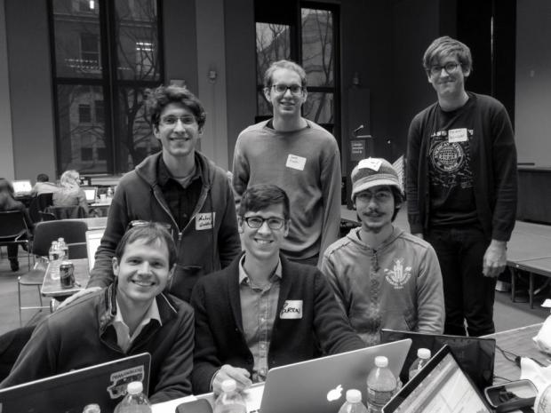

## Appendix

### Making plots look nice, in detail
A thing you need to know is how to remove all of the default
components of base R plots so that you can add only the things that
you want. This code basically does that.

    height.vid <- 9/16
    width.vid  <- 16/9
    plot(x=0, y=0, asp=1, type='n',
         xlim=-2+c(1,80),
         ylim=-15+c(-15,height.vid*80-15),
         xlab='', ylab='', main='')

The result is a blank canvas with a coordinate system configured
exactly as we want.

Now let's go through that step by step. Start with a really simple plot.

    plot(
      x=0,
      y=0
    )

First, let's set the dimensions.

    height.vid <- 9/16
    width.vid  <- 16/9

    plot(
      x=0,
      y=0,
      xlim=-2+c(1,80),
      ylim=-15+c(-15,height.vid*80-15)
    )

Now let's set the aspect ratio so that the canvas size doesn't affect
how the plot looks.

    plot(
      x=0,
      y=0,
      xlim=-2+c(1,80),
      ylim=-15+c(-15,height.vid*80-15),
      asp=1
    )

I'm removing the xlab and xlab because they're not in the places
I want them.

    plot(
      x=0,
      y=0,
      xlim=-2+c(1,80),
      ylim=-15+c(-15,height.vid*80-15),
      asp=1,
      xlab='',
      ylab='',
      main=''
    )

And now I'm removing the axes

    plot(
      x=0,
      y=0,
      xlim=-2+c(1,80),
      ylim=-15+c(-15,height.vid*80-15),
      asp=1,
      xlab='',
      ylab='',
      main='',
      axes=F,
      type='n'
    )

and the data.

    plot(
      x=0,
      y=0,
      xlim=-2+c(1,80),
      ylim=-15+c(-15,height.vid*80-15),
      asp=1,
      xlab='',
      ylab='',
      main='',
      type='n'
    )

The result is a blank canvas with a coordinate system configured
exactly as we want. Now we can start adding things on top.

### Realtime sound-synthesis approaches
I am very dissatisfied with my approach of writing wave files, as they
are very slow to write. Two alternatives are to use midi, where you
specify the notes to be played and then the sounds come from a
ready-made library called a sound font, or a realtime sound synthesis
thingy like Supercollider.

* Midi
* Realtime sound wave synthesis

I have dabbled with both of these, but I wind up writing my own sound
synthesis software that writes wave files because configuring midi or
Supercollider is too hard for me.

> The hardest part of making data music videos is configuring audio on Linux

The hardest part of making data music videos is configuring audio on Linux

### More stuff I removed

Pro tip: Free software is usually better.
I looked at the various free software for statistics, and R seemed
like the best one. I think it was a good choice.

> I made graphs in base R graphics. (You should use ggplot.)

I kind of knew about ggplot at the time, but I didn't use it for
some reason. In retrospect, I think videos are easier to make in
base R graphics, but ggplot is better for pretty much anything else.
Here's the first video I made in R.

> [Christmas gifts](http://small.dada.pink/christmas/christmas.webm)

Several years later, I met Brian.

Brian has a background in music, and he had started making music in R.

We're part of that group called "csv soundsystem" that works on
projects around music, journalism, computer programming.

One of us had
taken interest in the United States Treasury data that you experienced
earlier, so we assembled the data one weekend and made that video.

##

> If you are going to make data music videos, R is a good tool.
>
> 1. Vector graphics (for video)
> 2. Optimized matrix operations (for music)
> 3. Integrations with many standard data stores

R is a pretty good tool for making data music videos.

