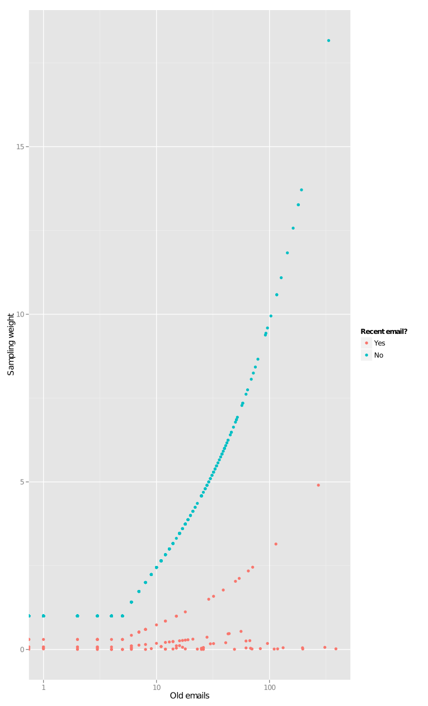
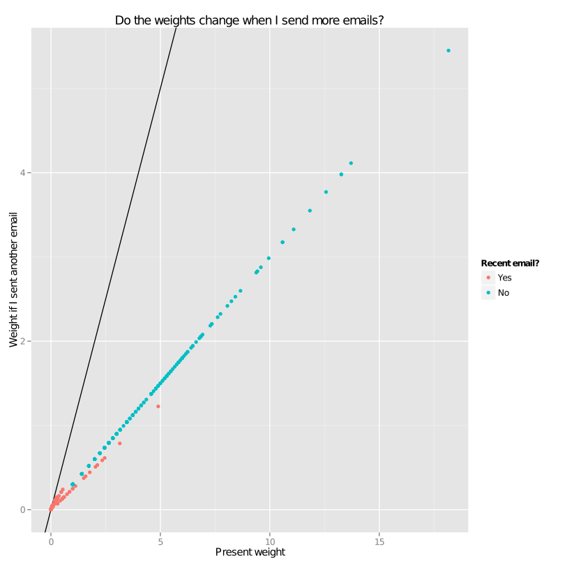

I like to know what my friends lives are like, and they seem
to like to know what mine is like, so I like to send them emails
about what my life is like.

## Whom to email?
I am too friendly, it seems; I always feel like I missed someone.
I tried thinking of more people, but it always seemed arbitrary,
and I still knew I was missing major groups of people. Also,
I wanted to be distinguish between people whom I had communicated
with recently and people whom I hadn't communicated with recently,
as the two groups should receive very different emails.

Surely my computer that is sending the emails could also help me
decide whom to send them to!

## How it works
Conceptually, I am looking for people whom I know very well but don't
talk to anymore, as these are the people I am most likely to have
forgotten to contact. I wrote a program that looks at my email and
tries to approximate this concept.

### Data sources
The system reads my mutt alias file, which is a list of email addresses
and names. With each email address (one at a time), I look up how many
times I have exchanged email addresses with it and when those exchanges
were. I produce a score for each email address, then I order the email
addresses by that score and look at the top few. Then I write emails to
a few of them.

The scoring is designed such that people whom I just emailed get low
scores. This way, the next time I run the system, new people appear at
the top of my list.

### Scoring
Most of my incoming emails are from mailing lists, and many of the
emails that I send are either to mailing lists or to work colleagues
that I don't know particularly well. I managed to come up with a rather
simple function that worked pretty well.

The function requires two numbers that describe the entirity of my
interactions with that email address.

* The number of emails I sent to it before 16 weeks ago
* The number of emails I sent to it after 16 weeks ago

I look only at emails that were sent from one of my email addresses
to that email address; this seemed to filter out people whom I emailed
with a lot but didn't email, like people with whom I was involved in
computer support discussions on mailing lists.

### Tuning the parameters
I don't have any good way of testing whether I am finding the right
people; all I can tell is that I am not finding the wrong people.
I made some graphs like the the ones below to check that I was finding
the sort of people whom I wanted to find. Each point on either graph is
a person (an email address in my mutt alias file), so I check the graph
to see whether people have the scores that I would expect them to have.

Two notes on the graphs

1. These graphs say "weight" rather than "score" because they are
   from the earliest versions of the system, where I was saying "weight"
   instead of "score".
2. When I was looking at these graphs, I plotted names on the graph rather
   then just point. I have removed the names because I think a lot of these
   people would rather not have their names in a graph on my website.
